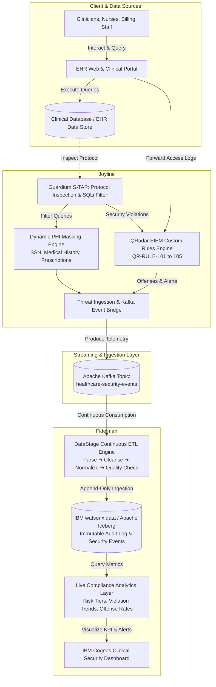

# Healthcare Data Security & Compliance Hub

**IBM watsonx.ai Phase 3 Cornerstone Project — Team 2**

[](file:///c:/Users/Administrator/healthcare-data-security-compliance-hub/security/tests)
[](file:///c:/Users/Administrator/healthcare-data-security-compliance-hub/security)
[](file:///c:/Users/Administrator/healthcare-data-security-compliance-hub/pipeline)
[](file:///c:/Users/Administrator/healthcare-data-security-compliance-hub/docs/qradar-guardium-architecture.md)

---

## Executive Overview

The **Healthcare Data Security & Compliance Hub** is an enterprise-grade compliance monitoring and threat detection platform engineered for healthcare data ecosystems. Centered around a **Clinical Security Officer Dashboard** backed by a real-time compliance analytics layer, the platform ingests Electronic Health Record (EHR) access logs, clinician transactions, and patient portal authentication events.

The system delivers two foundational security and compliance capabilities:
1. **HIPAA-Style Role-Based Access Control (RBAC) Enforcement:** Real-time policy enforcement and dynamic data masking that restricts data access based on clinical necessity and flags unauthorized access patterns.
2. **Immutable Audit Logging in watsonx.data:** Comprehensive tracking of every single access request and database query against patient records into an append-only, tamper-evident Apache Iceberg table format, queried live by the compliance analytics engine.

---

## Project Specification & Team

- **Sector:** Healthcare / Healthtech (EHR records, patient intake logs, lab results, prescription data, billing)
- **Pathway:** DataStage & watsonx.data (Fidelmah) + IBM Security Guardium & QRadar SIEM (Joyline)
- **Primary Audience Feature:** Clinical Security Officer Dashboard with underlying real-time compliance analytics
- **Supervisor:** Peter Youngren

### Team Roles & Responsibilities

| Team Member | Track | Core Responsibilities |
|---|---|---|
| **Joyline Kamoing** | Cybersecurity | QRadar SIEM Custom Rules Engine (CRE), Ariel Query Language (AQL) threat hunting, IBM Security Guardium Database Activity Monitoring (DAM), Dynamic PHI Data Masking, SQL Injection defense |
| **Fidelmah Mbondo** | Data Science & Analysis | Apache Kafka event streaming, DataStage continuous ETL pipeline (Parse, Cleanse, Normalize, Quality Check), watsonx.data (Apache Iceberg) lakehouse storage, Compliance Analytics layer |

---

## End-to-End System Architecture



---

## Key Pillars: RBAC Enforcement & Immutable Audit Logging

### 1. HIPAA-Style Role-Based Access Control (RBAC) Enforcement

The platform enforces strict role-based data isolation adhering to the **HIPAA Privacy Rule (45 CFR § 164.502)** and the **Minimum Necessary Standard (45 CFR § 164.502(b))**:

- **Role Segregation Matrix:**
  - **Physicians & Nurses:** Granted full access to clinical diagnoses, treatment notes, and prescription data for active care. Personally Identifiable Information (SSN) is masked (`XXX-XX-XXXX`).
  - **Billing & Administrative Staff:** Granted access to billing identifiers and partial SSN (`***-**-6789`), but clinical diagnoses and psychiatric history are dynamically redacted (`[RESTRICTED MEDICAL HISTORY]`).
  - **Pharmacists:** Granted access to prescription and medication records; diagnostic and billing details remain restricted.
  - **Lab Technicians:** Restricted to lab requisition and result entries only.
- **Dynamic PHI Masking Engine (Guardium DAM):** Intercepts SQL queries before results are returned to the client application, redacting sensitive text on-the-fly without altering physical database storage.
- **Automated Anomaly & Policy Violation Offenses (QRadar SIEM):**
  - Flags staff attempting to view charts outside their authorized clinical department.
  - Detects care-team boundary violations when accessing VIP or restricted patient records (`QR-RULE-103`).
  - Flags unassigned off-hours database access (22:00–05:00 UTC) (`QR-RULE-104`).

#### Dynamic PHI Masking Matrix

| Role | Social Security Number (SSN) | Medical History & Diagnoses | Prescriptions & Medications | Billing & Financial Data |
|---|---|---|---|---|
| **Physician** | Full Mask (`XXX-XX-XXXX`) | **Full Access (Unmasked)** | **Full Access (Unmasked)** | Restricted |
| **Nurse** | Full Mask (`XXX-XX-XXXX`) | **Full Access (Unmasked)** | **Full Access (Unmasked)** | Restricted |
| **Billing Clerk** | **Partial Mask (`***-**-6789`)** | **Masked (`[RESTRICTED MEDICAL HISTORY]`)** | Restricted | **Full Access** |
| **Pharmacist** | Full Mask (`XXX-XX-XXXX`) | Masked (`[RESTRICTED MEDICAL HISTORY]`) | **Full Access (Unmasked)** | Restricted |
| **Lab Tech** | Full Mask (`XXX-XX-XXXX`) | Masked (`[RESTRICTED MEDICAL HISTORY]`) | Restricted | Restricted |
| **Admin / Compliance** | **Partial Mask (`***-**-6789`)** | Masked (`[RESTRICTED MEDICAL HISTORY]`) | Restricted | **Full Access** |

---

### 2. Immutable Audit Logging in watsonx.data

Every interaction, query, login, and record export is captured in an **append-only, immutable audit log** stored in **watsonx.data** using the **Apache Iceberg** table format:

- **Comprehensive Telemetry:** Logs user ID, role, client IP, target patient ID, action type, timestamp (UTC ISO-8601), authorization status, Guardium masking flags, and QRadar offense tags.
- **Immutability & Integrity:** Stored in Apache Iceberg tables with snapshot isolation, cryptographic transaction IDs, and tamper-evident append-only policies (no `UPDATE` or `DELETE` operations permitted on the audit ledger).
- **Partitioning Strategy:** Partitioned by date (`event_date`) to optimize analytical scan efficiency for SOC investigators and compliance auditors.
- **Direct Querying via Presto/Trino:** Powers live SQL queries executed by the compliance analytics engine for violation trend forecasting, risk tier breakdowns, and incident timelines.

#### Audit Log Schema (`watsonx.data.audit_log`)

| Column Name | Data Type | Description |
|---|---|---|
| `event_id` | `VARCHAR(36)` | Unique UUID identifying the access event |
| `event_timestamp` | `TIMESTAMP` | UTC timestamp of access / query |
| `user_id` | `VARCHAR(64)` | Identifier of the requesting clinician/staff |
| `user_role` | `VARCHAR(32)` | Role context (physician, nurse, billing_clerk, etc.) |
| `action` | `VARCHAR(64)` | Action performed (`view_patient`, `mdm_resolve`, `dispatch_referral`) |
| `record_type` | `VARCHAR(32)` | Model type (`patient`, `encounter`, `lab_result`, `referral`) |
| `record_id` | `VARCHAR(64)` | Unique entity identifier accessed |
| `facility_id` | `VARCHAR(64)` | Originating healthcare facility |
| `golden_id` | `VARCHAR(64)` | Cross-facility MDM identity (if resolved) |
| `authorized` | `BOOLEAN` | Whether request satisfied RBAC policy |
| `is_violation` | `BOOLEAN` | Set to `TRUE` if flagged by QRadar or Guardium |
| `risk_tier` | `VARCHAR(16)` | Risk classification (`LOW`, `MEDIUM`, `HIGH`, `CRITICAL`) |
| `masking_applied`| `BOOLEAN` | Whether dynamic PHI redaction was triggered |
| `source_system` | `VARCHAR(32)` | Ingestion origin (`qradar`, `guardium`, `ehr_portal`) |
| `ingested_at` | `TIMESTAMP` | Timestamp of DataStage ingestion |

---

## Detailed Track Breakdown

### Track 1: Cybersecurity & Threat Detection (Joyline Kamoing)

Detailed documentation: [QRadar & Guardium Architecture](file:///c:/Users/Administrator/healthcare-data-security-compliance-hub/docs/qradar-guardium-architecture.md) | [Security README](file:///c:/Users/Administrator/healthcare-data-security-compliance-hub/security/README.md)

#### A. IBM QRadar SIEM Custom Rules Engine (CRE)
Configured in [`security/qradar/qradar_rules.json`](file:///c:/Users/Administrator/healthcare-data-security-compliance-hub/security/qradar/qradar_rules.json) and exported to [`security/qradar/qradar_rules.xml`](file:///c:/Users/Administrator/healthcare-data-security-compliance-hub/security/qradar/qradar_rules.xml):
- **`QR-RULE-101` (Unauthorized Chart View):** Flags non-clinical staff attempting to view medical charts (`HIPAA § 164.312(a)(1)`).
- **`QR-RULE-102` (Bulk Record Exfiltration):** Flags mass downloads (>= 5 patient records within 300 seconds) (`HIPAA § 164.312(b)`).
- **`QR-RULE-103` (VIP Patient Record Snooping):** Detects access to high-profile/VIP patients by staff outside the assigned care team (`HIPAA § 164.502`).
- **`QR-RULE-104` (Off-Hours High-Volume EHR Query):** Detects off-hours access (22:00–05:00 UTC) by non-shift personnel (`HIPAA § 164.308(a)(1)(ii)(D)`).
- **`QR-RULE-105` (Multi-Patient Sequential Scraping):** Flags automated bot-like scraping querying >= 4 distinct patient records in < 60 seconds (`HIPAA § 164.312(e)(1)`).
- **Ariel Query Language (AQL):** Threat hunting queries in [`security/qradar/aql_queries.sql`](file:///c:/Users/Administrator/healthcare-data-security-compliance-hub/security/qradar/aql_queries.sql).

#### B. IBM Security Guardium DAM & S-TAP Security Policies
Configured in [`security/guardium/guardium_policies.yaml`](file:///c:/Users/Administrator/healthcare-data-security-compliance-hub/security/guardium/guardium_policies.yaml):
- **`GD-POL-01`:** Direct unauthorized table access detection.
- **`GD-POL-02`:** Dynamic SSN / National ID masking.
- **`GD-POL-03`:** Dynamic clinical history & psychiatric note redaction.
- **`GD-POL-04`:** Real-time SQL Injection signature detection & session termination.
- **`GD-POL-05`:** Query rate anomaly monitoring (> 100 rows/min).

#### C. Threat Scenarios & Simulation Suite
Defined in [`security/threat_scenarios.py`](file:///c:/Users/Administrator/healthcare-data-security-compliance-hub/security/threat_scenarios.py) and executed via [`security/threat_ingestion.py`](file:///c:/Users/Administrator/healthcare-data-security-compliance-hub/security/threat_ingestion.py):
1. `unauthorized_chart_view`: Billing clerk snooping on clinical psychiatric chart.
2. `bulk_download`: Nurse executing off-hours mass oncology exfiltration.
3. `vip_snooping`: Lab tech snooping on VIP senator record without care team membership.
4. `sql_injection`: Patient portal SQL injection attack (`' OR '1'='1'`) intercepted by Guardium.
5. `scraping`: Multi-patient rapid record discovery by billing clerk.
6. `authorized_baseline`: Attending physician routine cardiology review.

---

### Track 2: Data Pipeline & Compliance Analytics (Fidelmah Mbondo)

Detailed documentation: [Handoff Notes](file:///c:/Users/Administrator/healthcare-data-security-compliance-hub/docs/handoff-notes.md) | [DataStage Design](file:///c:/Users/Administrator/healthcare-data-security-compliance-hub/docs/datastage-design.md)

#### A. Stream Ingestion & Local Kafka Broker
- Containerized Apache Kafka broker running in **KRaft mode** via [`pipeline/docker-compose.yml`](file:///c:/Users/Administrator/healthcare-data-security-compliance-hub/pipeline/docker-compose.yml).
- Dedicated ingestion topic: `healthcare-security-events`.
- Mock event generator in [`pipeline/mock_event_generator.py`](file:///c:/Users/Administrator/healthcare-data-security-compliance-hub/pipeline/mock_event_generator.py) generating realistic baseline & anomaly traffic.

#### B. DataStage ETL Pipeline Logic
Implemented and validated in [`pipeline/pipeline_validator.py`](file:///c:/Users/Administrator/healthcare-data-security-compliance-hub/pipeline/pipeline_validator.py) mirroring the 4 DataStage stages:
1. **Parse:** Decode raw JSON/CSV and catch malformed messages.
2. **Cleanse:** Standardize timestamps to UTC ISO-8601, normalize casing, coerce booleans.
3. **Normalize:** Map EHR, portal, lab, and prescription schemas to a unified record structure.
4. **Quality Check:** Validate required fields, allowed roles, and record types (`CLEAN`, `FLAGGED`, `DROPPED`).

#### C. Compliance Analytics Engine (watsonx.data / Presto SQL)
Pre-aggregated analytics powering the Clinical Security Officer Dashboard:
- **Violation Trends:** Daily & hourly unauthorized access counts.
- **Risk Tier Breakdown:** Distribution of `HIGH`, `MEDIUM`, `LOW` security incidents.
- **Top Policy Violators:** Identification of users triggering repeat QRadar offenses.
- **Audit Investigation Feed:** Real-time query log for immediate forensic response.

---

## Repository Structure

```
healthcare-data-security-compliance-hub/
├── README.md                              # Main project documentation & architecture overview
├── docs/                                  # Technical documentation & handoff notes
│   ├── qradar-guardium-architecture.md    # In-depth security architecture & demo scripts (Joyline)
│   ├── handoff-notes.md                   # Pipeline implementation & validation notes (Fidelmah)
│   └── datastage-design.md                # DataStage ETL stage design & mapping specs
├── pipeline/                              # Data engineering & stream processing (Fidelmah)
│   ├── docker-compose.yml                 # Local Kafka broker (KRaft mode)
│   ├── mock_event_generator.py            # QRadar/Guardium mock stream generator
│   └── pipeline_validator.py              # 4-stage DataStage transformation validator
└── security/                              # Cybersecurity & threat detection (Joyline)
    ├── README.md                          # Security track guide
    ├── threat_ingestion.py                # Main CLI service for threat analysis & Kafka bridge
    ├── threat_scenarios.py                # Curated realistic attack & baseline scenarios
    ├── qradar/
    │   ├── qradar_rules.json              # QRadar SIEM Custom Rules Engine (CRE) rules
    │   ├── qradar_rules.xml               # QRadar XML Content Management Export
    │   ├── aql_queries.sql                # Ariel Query Language (AQL) threat hunting queries
    │   └── qradar_engine.py               # QRadar offense simulator & rule evaluator
    ├── guardium/
    │   ├── guardium_policies.yaml         # Guardium DAM & S-TAP security policies (YAML)
    │   ├── guardium_policies.json         # Guardium DAM policies (JSON)
    │   ├── phi_masker.py                  # Dynamic role-based PHI data masking engine
    │   └── guardium_engine.py             # Guardium S-TAP monitor & SQLi filter
    └── tests/
        ├── test_qradar_rules.py           # Unit tests for QRadar anomaly detection rules
        ├── test_guardium_masking.py       # Unit tests for Guardium PHI masking & DAM
        └── test_pipeline_integration.py   # E2E integration test for DataStage schema compatibility
```

---

## Getting Started & Execution Guide

### Prerequisites
- Python 3.10+
- Docker & Docker Compose
- Required Python packages: `pip install kafka-python pyyaml`

### 1. Run the Security & Integration Test Suite
Verify QRadar rules, Guardium masking, and DataStage schema compatibility:
```bash
python -m unittest discover -s security/tests -p "test_*.py" -v
```

### 2. Execute Threat Detection & PHI Masking (Dry Run)
Simulate QRadar offense generation and Guardium dynamic masking across all 6 threat scenarios:
```bash
python security/threat_ingestion.py --mode dry-run --scenario all
```

### 3. Start Local Kafka Broker
```bash
cd pipeline
docker compose up -d

# Create topic (first time only)
docker exec -it healthcare-kafka /opt/kafka/bin/kafka-topics.sh \
  --create --topic healthcare-security-events \
  --bootstrap-server localhost:9092 --partitions 1 --replication-factor 1
```

### 4. Stream Security Telemetry into Kafka
Stream threat scenarios or mock baseline events into Kafka:
```bash
# Option A: Stream specific attack scenarios
python security/threat_ingestion.py --mode kafka --scenario all

# Option B: Stream continuous synthetic baseline/anomaly mix
python pipeline/mock_event_generator.py --count 100 --rate 0.2 --anomaly-rate 0.3
```

### 5. Run Local Pipeline Validation
Validate DataStage continuous-mode ingestion and 4-stage data cleansing:
```bash
python pipeline/pipeline_validator.py --from-beginning
```

---

## Project Status & Roadmap

- [x] **HIPAA-Style Role-Based Access Control (RBAC):** Guardium dynamic masking matrix and QRadar role boundary rules implemented and tested.
- [x] **Immutable Audit Log Pipeline:** Ingestion schema, quality controls, and Apache Iceberg table definition established for watsonx.data.
- [x] **Event Schema Grounded in Healthtech Reference Models:** Patient, Encounter, LabResult, Referral models and MDM cross-facility identities integrated.
- [x] **Local Kafka Broker:** Running in Docker (KRaft mode) with `healthcare-security-events` topic.
- [x] **QRadar SIEM Anomaly Detection:** Rules `QR-RULE-101` through `105` implemented, tested, and exported in JSON/XML with AQL queries.
- [x] **IBM Security Guardium DAM:** Dynamic PHI masking engine, S-TAP SQL injection blocking, and YAML policies.
- [x] **Threat Scenarios & Bridge:** 6 curated clinical attack scenarios with dry-run and Kafka live streaming CLI.
- [x] **DataStage Transform Logic:** Parse, cleanse, normalize, and quality-check stages validated locally.
- [x] **Automated Test Suite:** 10/10 unit and integration tests passing.
- [ ] **TechZone Deployment:** DataStage job deployment and connection to cloud broker.
- [ ] **watsonx.data Lakehouse:** Iceberg table provisioning and audit log ingest.
- [ ] **Compliance Analytics & Cognos Dashboard:** Visualizing real-time violation trends and risk tiers.
- [ ] **End-to-End Live Incident Flow Demo.**

---

## Demonstration Script (10–15 Minutes)

| Time | Segment | Speaker | Highlights |
|---|---|---|---|
| **0:00 – 2:00** | Problem & Regulatory Context | Both | Healthcare insider threats, HIPAA Minimum Necessary standard, project goals. |
| **2:00 – 6:00** | Cybersecurity & RBAC Enforcement | Joyline | QRadar CRE anomaly offenses (`QR-RULE-101` unauthorized view, `102` bulk exfiltration, `103` VIP snooping), Guardium SQL injection block, role-based PHI dynamic masking (Billing Clerk vs. Physician). |
| **6:00 – 9:00** | Data Pipeline & Ingestion | Fidelmah | Kafka event streaming, DataStage 4-stage transform logic (Parse ➔ Cleanse ➔ Normalize ➔ Quality Check), handling malformed vs. anomalous data. |
| **9:00 – 12:00** | Immutable Audit Log & watsonx.data Analytics | Fidelmah | watsonx.data Iceberg storage, compliance analytics queries (risk tier breakdown, violation trends), Cognos dashboard. |
| **12:00 – 14:00** | End-to-End Incident Flow | Both | Trigger simulated attack scenario ➔ Guardium masks/blocks ➔ QRadar flags offense ➔ Kafka streams ➔ DataStage cleanses ➔ watsonx.data audit log appends ➔ Dashboard alerts update. |
| **14:00 – 15:00** | Q&A and Wrap-up | Both | Review of architecture, key takeaways, and lessons learned. |